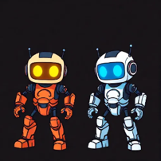
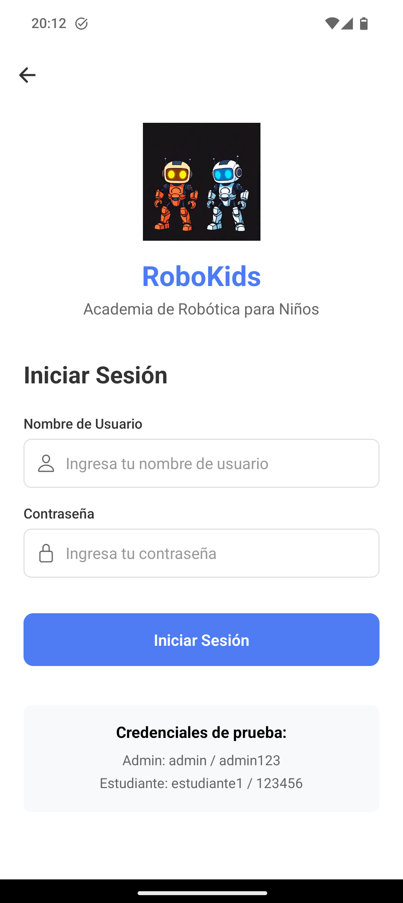
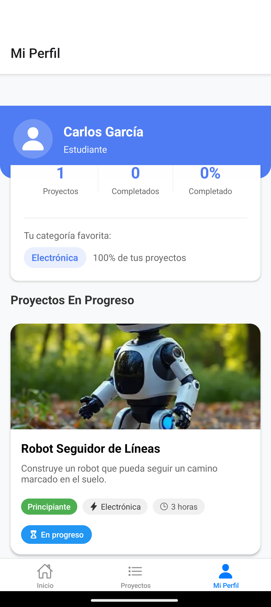
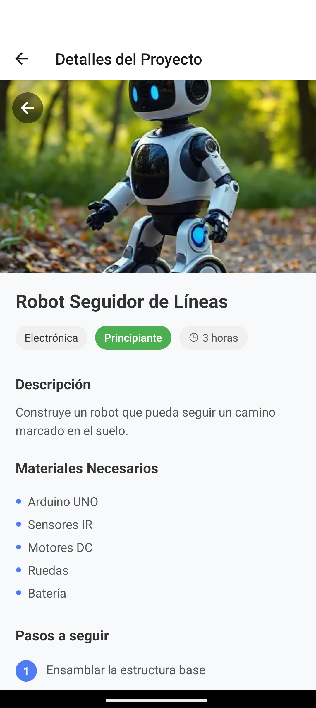
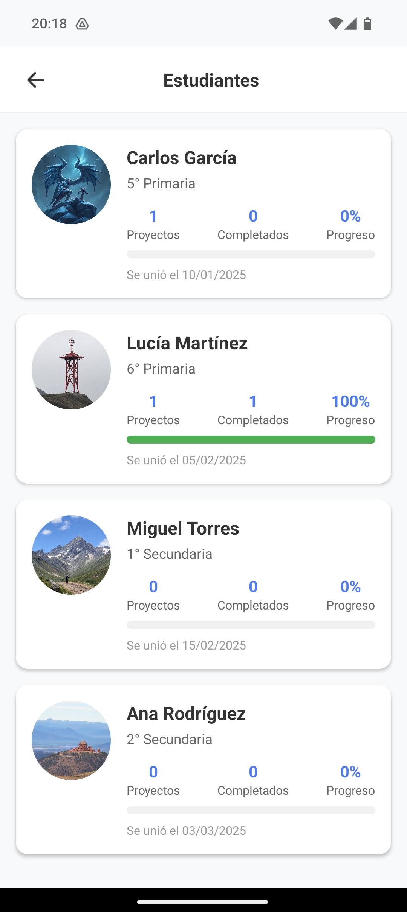
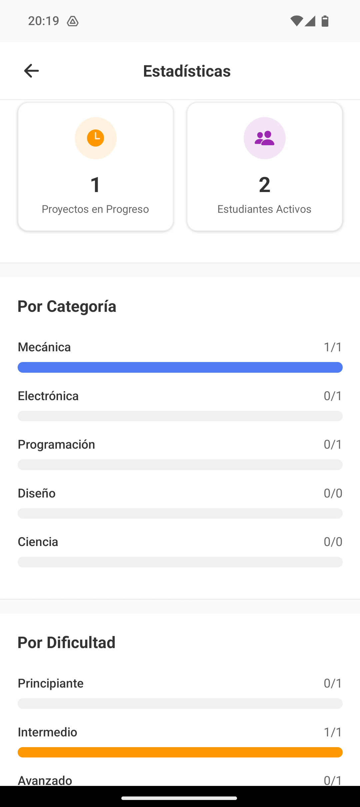
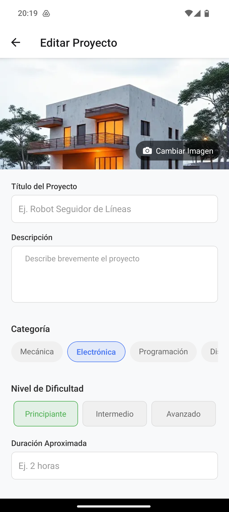

# RoboLearn: App de Cursos de Robótica

Una aplicación móvil desarrollada con React Native, diseñada para ofrecer cursos de robótica para niños de una manera divertida e interactiva. La plataforma cuenta con dos roles de usuario (Administrador y Alumno) para una gestión y experiencia de aprendizaje personalizadas.



## 📋 Tabla de Contenidos

1.  [Acerca del Proyecto](#-acerca-del-proyecto)
2.  [🚀 Características Principales](#-características-principales)
3.  [📸 Capturas de Pantalla](#-capturas-de-pantalla)
4.  [🛠️ Stack Tecnológico](#-stack-tecnológico)
5.  [⚙️ Instalación y Puesta en Marcha](#-instalación-y-puesta-en-marcha)
6.  [▶️ Uso](#-uso)
7.  [📂 Estructura del Proyecto](#-estructura-del-proyecto)
8.  [📄 Licencia](#-licencia)
9.  [📧 Contacto](#-contacto)

## 🤖 Acerca del Proyecto

**RoboLearn** es una solución móvil que busca acercar el mundo de la robótica a los más pequeños. La aplicación permite a los niños explorar un catálogo de cursos, clasificados por temática y nivel de dificultad, y seguir su propio ritmo de aprendizaje.

La aplicación cuenta con dos vistas principales dependiendo del tipo de usuario que inicie sesión:

*   **Perfil de Alumno:** Enfocado en el aprendizaje, permitiendo a los niños consultar actividades, marcar su progreso y visualizar sus logros.
*   **Perfil de Administrador:** Un panel de control completo para gestionar el contenido de la aplicación (crear, editar y eliminar actividades) y hacer un seguimiento detallado del progreso de cada alumno.

## 🚀 Características Principales

### Para Alumnos 👦👧

*   **Inicio de Sesión Seguro:** Acceso personal a su perfil y cursos.
*   **Catálogo de Cursos:** Explora actividades de robótica organizadas por temática (ej: Brazos Robóticos, Drones, Sensores) y por nivel (Principiante, Intermedio, Avanzado).
*   **Seguimiento de Progreso:** Al finalizar una actividad, los alumnos pueden marcarla como "completada".
*   **Perfil Personal:** Una sección donde pueden ver sus estadísticas de aprendizaje:
    *   Porcentaje total de cursos completados.
    *   Número de actividades realizadas.
    *   Número de actividades pendientes.

### Para Administradores 👨‍💼👩‍💼

*   **Panel de Administración:** Una interfaz exclusiva para la gestión total de la plataforma.
*   **Gestión de Contenido (CRUD):** Los administradores pueden crear, leer, actualizar y eliminar cursos y actividades de forma sencilla.
*   **Gestión de Alumnos:** Un apartado para visualizar a todos los alumnos registrados en la plataforma.
*   **Estadísticas de Alumnos:** Acceso a las métricas de progreso de cada alumno, permitiendo un seguimiento personalizado de su rendimiento.

## 📸 Capturas de Pantalla

Estas son unas capturas de pantalla de cómo se ve la aplicación.

| Login                               | Perfil de Alumno                       | Detalle del Curso                       |
| ----------------------------------- | -------------------------------------- | --------------------------------------- |
|  |  |  |

| Panel de Admin                         | Estadísticas de Alumnos (Admin)             | Editor de Actividades (Admin)                   |
| -------------------------------------- | --------------------------------------------- | ----------------------------------------------- |
|  |  |  |

## 🛠️ Stack Tecnológico

*   **Frontend:** [React Native](https://reactnative.dev/)
*   **Navegación:** [React Navigation](https://reactnavigation.org/)
*   **Gestión de Estado:** [Redux Toolkit](https://redux-toolkit.js.org/) / [Context API](https://es.reactjs.org/docs/context.html) (Elige el que hayas usado)
*   **Backend & Base de Datos:** [Firebase](https://firebase.google.com/) (Firestore, Authentication) / o especifica tu stack (ej: Node.js, Express, MongoDB)
*   **UI Kit:** [React Native Paper](https://callstack.github.io/react-native-paper/) / Estilos personalizados con `StyleSheet`.

## ⚙️ Instalación y Puesta en Marcha

Sigue estos pasos para tener una copia del proyecto funcionando en tu máquina local.

**Requisitos previos:**
*   Node.js (v16 o superior)
*   npm o yarn
*   Entorno de desarrollo de React Native configurado (sigue la [guía oficial](https://reactnative.dev/docs/environment-setup)).

**Pasos:**

1.  **Clona el repositorio:**
    ```bash
    git clone https://github.com/raulvidalvalles/CursosRobotica.git
    ```

2.  **Navega al directorio del proyecto:**
    ```bash
    cd CursosRobotica
    ```

3.  **Instala las dependencias:**
    ```bash
    npm install
    # o si usas yarn
    yarn install
    ```

4.  **(Opcional) Configura las variables de entorno:**
    Si usas servicios como Firebase, crea un archivo `.env` en la raíz del proyecto y añade tus credenciales.
    ```
    API_KEY=xxxxxxxxxxxxxxxxxxxx
    AUTH_DOMAIN=xxxxxxxxxxxxxxxx
    PROJECT_ID=xxxxxxxxxxxxxxxx
    ```

5.  **Inicia la aplicación:**
    *   **Para Android:**
        ```bash
        npx react-native run-android
        ```
    *   **Para iOS:**
        ```bash
        npx react-native run-ios
        ```

## ▶️ Uso

Una vez que la aplicación esté en funcionamiento, verás la pantalla de inicio de sesión. Puedes usar las siguientes credenciales de prueba:

*   **Usuario Administrador:**
    *   **Usuario:** `admin`
    *   **Contraseña:** `admin123`

*   **Usuario Alumno:**
    *   **Usuario:** `estudiante`
    *   **Contraseña:** `123456`

## 📂 Estructura del Proyecto

```
RoboLearn/
├── android/
├── ios/
├── src/
│   ├── api/          # Conexiones con el backend (ej. Firebase)
│   ├── assets/       # Imágenes, fuentes, etc.
│   ├── components/   # Componentes reutilizables (Botones, Cards, etc.)
│   ├── navigation/   # Stacks de navegación y rutas
│   ├── screens/      # Pantallas principales de la app (Login, Home, Profile, AdminDashboard)
│   ├── state/        # Lógica de estado (Redux, Context)
│   ├── styles/       # Estilos globales
│   └── utils/        # Funciones de ayuda
├── .env              # Variables de entorno
├── App.js            # Fichero de entrada principal
└── package.json
```

## 📄 Licencia

Este proyecto está bajo la Licencia MIT. Consulta el archivo `LICENSE` para más detalles.

## 📧 Contacto

**Raúl Vidal** - www.linkedin.com/in/raúl-vidal-vallés-515a7636a - raulvidalvalles@gmail.com

Link del Proyecto: https://github.com/Raulvidalvalles/CursosRobotica
